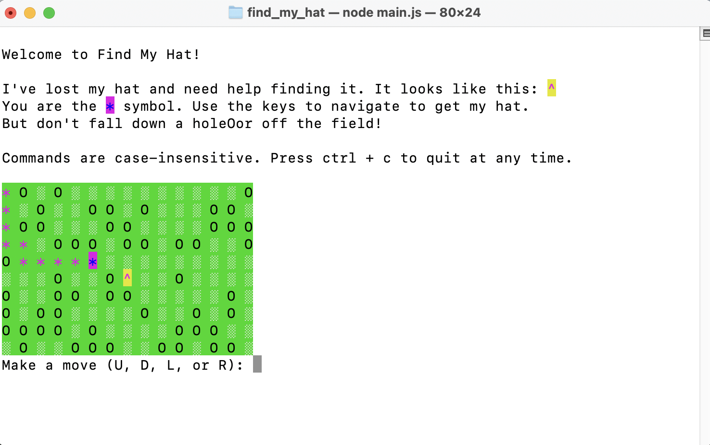

# Find My Hat
JavaScript terminal game to solve a maze and find my hat. 

## Table of contents
* [General information](#general-information)
* [Technologies](#technologies)
* [Setup](#setup)
* [Future Work](#future-work)
* [Inspiration](#inspiration)

## General information
This is a JavaScript project to generate a maze game that a user can play in the terminal. The user must try to navagate through the maze to find the hat, ^. The maze constructor contains a maze solver to ensure every randomly generated maze is solvable. 

Rules: A game field is generated that contains empty field characters (░) holes (O) and a randomly places hat (^). The user must use the keyboard to navigate through the field to the hat. The user loses if they step off the field (out of bounds) or into a hole, O. The user wins by getting to the hat, ^. 

Asterisks mark spaces on the field that the suer has traveled. The user uses keys to move:
* 'U' for up, towards the previous lines in the terminal
* 'D' for down, towards the current line in the terminal 
* 'R' for right
* 'L' for left

The user can continue playing as many times as they like, quit after the end of a game, or use ctrl+c to quit at any time. For each new game, the program generates a new randomized maze that is solvable. 

## Technologies
Project is created with:
* VS Code version 1.58.1
* Git version 2.30.1
* Node version 14.17.1
* npm version 7.20.5 
* promtp-sync version 4.2.0
* chalk version 4.1.2

## Setup
To play the game:
1. Download find_my_hat
2. cd to find_my_hat in terminal 
3. run `npm install` 
3. run `node main.js`

## Future Work 
* Add additional arrow key functionality to navigate the field.

## Inspiration 
This project is based on Codecademy's Find My Hat Project. Codecademy provided the rules of the game to be built and the libaraies needed to complete project.
